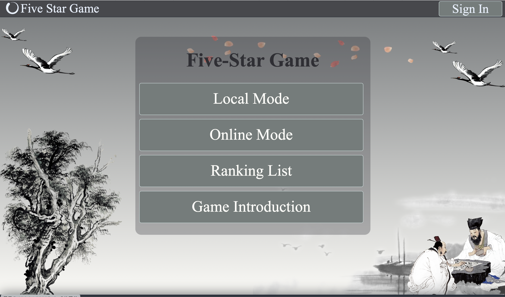
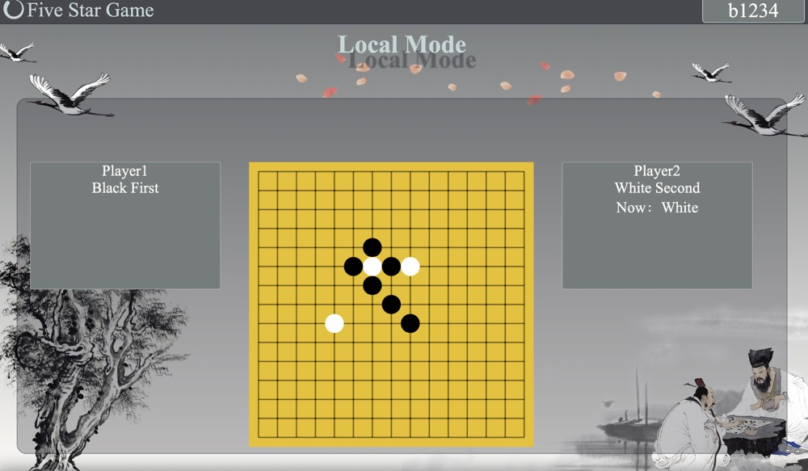
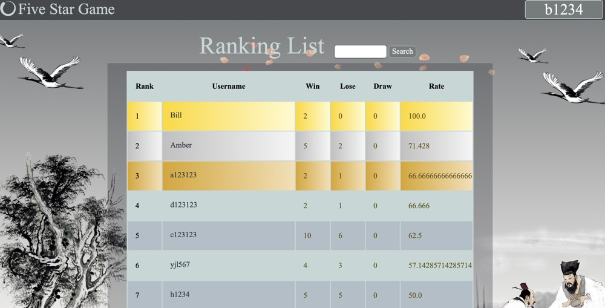
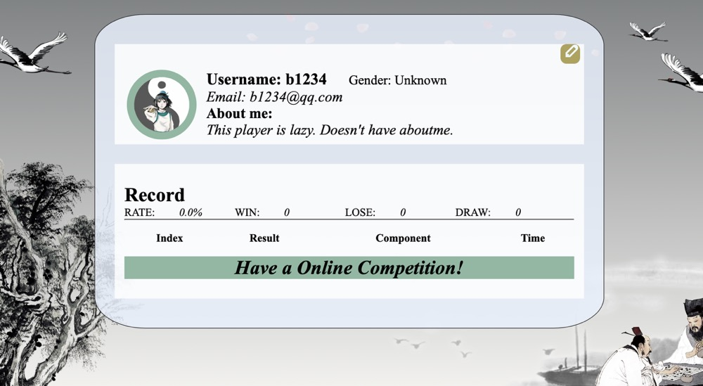

# Five-Star_Game
A Gomoku game website based on Flask backend website, which could be played online or locally.

Author: Bill-Flash & anonymous
## Features

- The local mode of Five-in-a-Row game.
1. User can play with their friends on the same window
1. It doesn't need player to log in.

1. Their scores would not be recorded into the Rank list.
- The online mode of Five-in-a-Row game.
1. Users play online with the competitor from different windows.
1. It requires the user to sign up and in.
1. Their scores would be recorded into the Rank list.
- Customized setting for logged-in Users
1. Log in, log out, editing profile and register functionality.
1. The past records show on the profile
1. Editing thier information
- Rank list and search functionality
1. User could see Top 10 of players according to the rate 
1. User could search the username to find the specific user
1. Logged-in user could see his/her Rank
1. User could see players' profile by clicking their name

- Game introduction
1. The page used for who don't know the rules of Five-in-a-Row game.
1. The page tells what user should do in different modes.
- Banner
1. It tells user some information that he/she should notice
- Nav bar
1. The part dynamically generates for logged/non-logged-in users
- Night and light mode
1. Click Dark button switch

## Milestone # 1 
- Customized setting for non-logged/logged-in Users
1. Log in, log out and register functionality.(The data validation is better than the slides and lab) Also, logged-in users can't go to the sign in or up page.(banner will warn against don't try this)
1. non-logged-in users view the local mode, rank list and game introduction
- Nav bar
1. The part dynamically generates for logged/non-logged-in users
- Game introduction
1. The page used for who don't know the rules of Five-in-a-Row game.
1. The page tells what the user should do in different modes.
- The interface and data validation of local and online mode
1. The website identifies whether the user has logged in.
1. The rough page of the interface for users to enter in. (It's not the ultimate version, just to show the identification functionality)
- Banner
1. It tells user some information that he/she should notice (log in, log out, the page the user can't enter)
- Rank list and search functionality
1. User could see Top 10 of players according the rate
1. User could search the username to find the specific user
1. Logged-in users could see his/her Rank
- **Some spans are imported from other websites, the Internet connection could render those spans.**

## Milestone # 2
- The local mode of Five-in-a-Row game.
1. User can play with their friends on the same window
1. It doesn't need player to log in.
1. Their scores would not be recorded into the Rank list.
- The online mode of Five-in-a-Row game.
1. Users play online with the competitor from different windows.
1. It requires the user to sign up and in.
1. Their scores would be recorded into the Rank list.
1. Their information could be seen by their component
- Customized setting for logged-in Users
1. Log in, log out, editing profile and register functionality.
1. The past records show on the profile
1. Editing thier information
- Rank list and search functionality
1. User could see Top 10 of players according to the rate
1. User could search the username to find the specific user
1. Logged-in user could see his/her Rank
1. User could see players' profile by clicking their name
- Game introduction
1. The page used for who don't know the rules of Five-in-a-Row game.
1. The page tells what user should do in different modes.
- Banner
1. It tells user some information that he/she should notice
- Nav bar
1. The part dynamically generates for logged/non-logged-in users
- Night and light mode
1. Click Dark button switch
